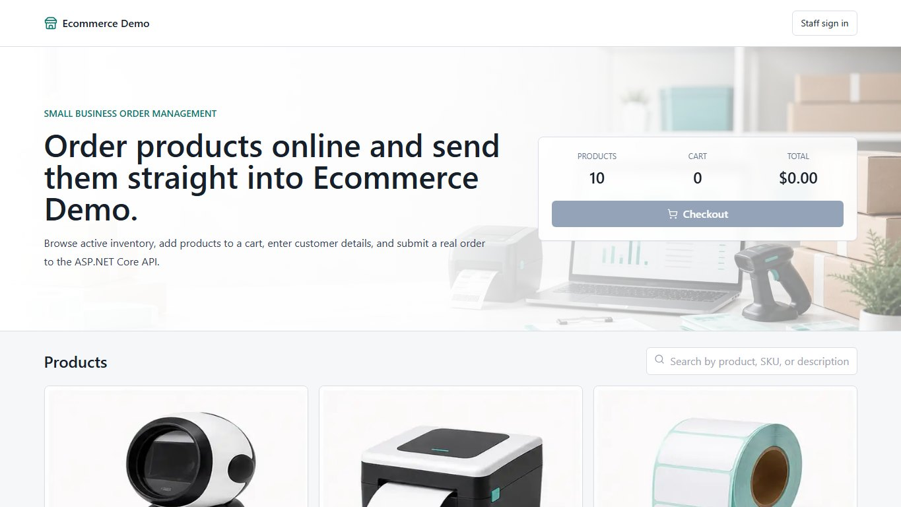
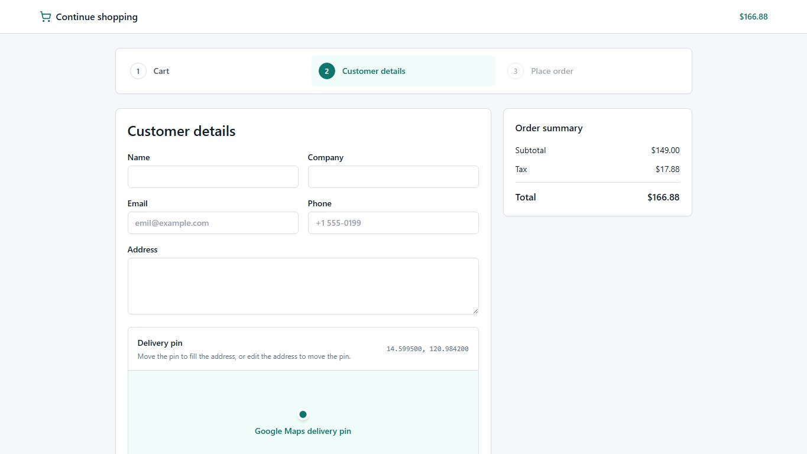
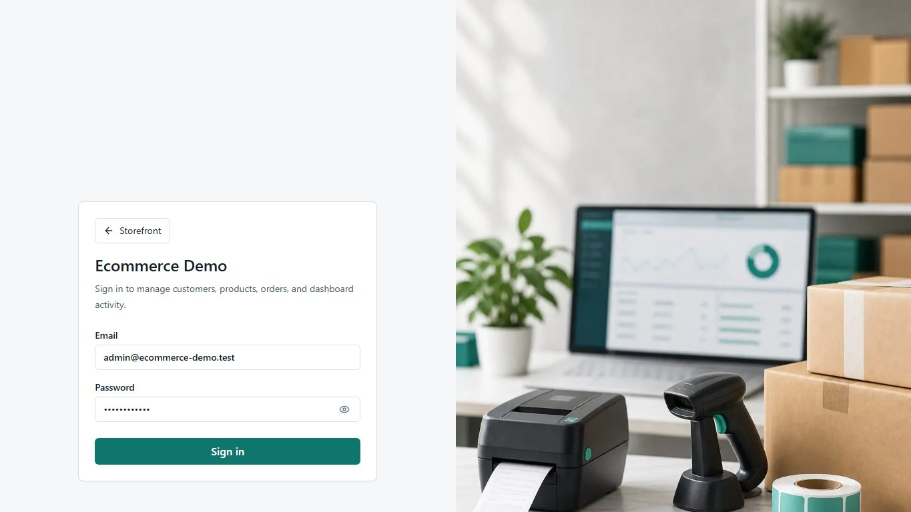
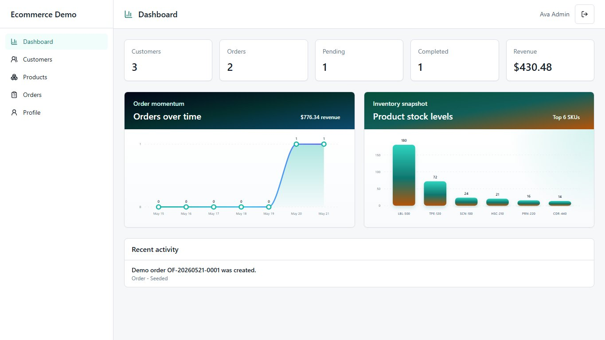
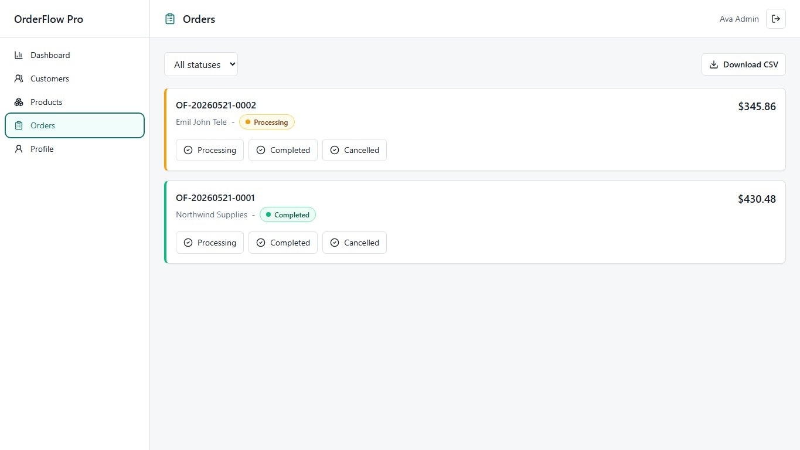
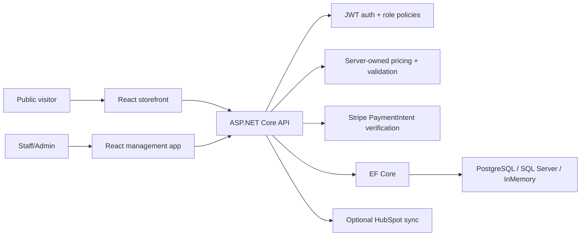

# Ecommerce Demo

[](https://github.com/pancakebaker/dotnet-react-ecommerce-demo/actions/workflows/ci.yml)


## Project Overview

Ecommerce Demo is a production-style full-stack ecommerce reference project built for demonstration and learning purposes. It combines a public storefront, responsive product catalog, cart checkout, Stripe PaymentIntent payment flow, staff/admin operations, JWT authentication, role-based authorization, EF Core persistence, automated tests, Docker packaging, and GitHub Actions CI.

The project is intentionally compact, but it exercises practical end-to-end ecommerce concerns: clean API boundaries, typed frontend models, server-side validation, server-owned pricing, PaymentIntent verification before order creation, role-aware back-office workflows, deployment configuration, and a user-facing flow that can be reviewed quickly.

This is not a production ecommerce platform without additional hardening, operational review, monitoring, secret management, payment review, and security work.

## Screenshots



| Checkout flow | Staff login | Staff dashboard | Order status workflow |
| --- | --- | --- | --- |
|  |  |  |  |

## What You Can Try

- Browse active products on the anonymous storefront.
- Search products, view product detail URLs, and add items to a cart.
- Move through checkout with customer validation, delivery address support, card payment, or cash on delivery.
- Create a Stripe PaymentIntent and submit an order with `paymentIntentId`.
- Sign in as staff or admin to review dashboard metrics, customers, products, orders, and profile details.
- Update order statuses and see activity reflected in dashboard data.
- Export orders to CSV, products to a styled PDF catalog, and checkout invoices to PDF.
- Run backend, frontend, and browser tests from a clean checkout.

## Demo Accounts

| Role | Email | Password |
| --- | --- | --- |
| Admin | `admin@ecommerce-demo.test` | `Password123!` |
| Staff | `staff@ecommerce-demo.test` | `Password123!` |

These accounts are seeded only for local demonstration. Replace credentials and JWT secrets before adapting this project for any non-demo environment.

## Tech Stack

| Area | Tools |
| --- | --- |
| Backend | .NET 8, ASP.NET Core minimal APIs, EF Core, JWT bearer authentication |
| Database | PostgreSQL or SQL Server by configuration, EF Core in-memory provider for quick local demos |
| Payments | Stripe PaymentIntents, Stripe Elements, PaymentElement |
| Frontend | React 18, TypeScript, Vite, Tailwind CSS, D3.js |
| Testing | xUnit API integration tests, Vitest unit/component tests, Playwright end-to-end tests |
| DevOps | GitHub Actions, Dockerfiles, Docker Compose |
| Integrations | Optional HubSpot order sync |

## Architecture



The frontend uses typed models and a small API client. The backend owns order pricing, validates request payloads, verifies payment state, persists orders through EF Core, and exposes authorization-protected staff/admin endpoints.

## Feature Highlights

- Public storefront with seeded products, responsive catalog cards, product detail URLs, and SEO metadata.
- Cart, customer details, review, and order placement checkout flow.
- Stripe Elements and PaymentElement card flow backed by server-created PaymentIntents.
- Backend verifies PaymentIntent `status == succeeded`, amount, and currency before creating a storefront order.
- Card data is handled by Stripe Elements; the API never receives raw card details.
- Cash on delivery option with invoice PDF download after order placement.
- Server-owned subtotal, tax, discount, and total calculations.
- Google Maps delivery pin that can reverse-geocode pin moves into the address field.
- Staff/admin JWT login with role-based access control and field-level permission checks.
- Dashboard metrics and D3 visualizations for orders, revenue, stock, and activity.
- Customer CRUD with search, pagination, contact fields, and client/server validation.
- Product CRUD with SKU, price, stock quantity, active/inactive state, and storefront cache invalidation.
- Order creation, line items, status workflow, activity logs, and optional HubSpot deal sync.
- Staff exports for order CSV reports and styled product PDF catalogs.
- Security headers, CORS configuration, strong JWT secret checks, and safe config practices.
- xUnit, Vitest, and Playwright coverage across API, frontend helpers/components, and browser journeys.
- Dockerfiles, Docker Compose database services, and GitHub Actions CI.

## Run Locally

Prerequisites:

- .NET 8 SDK
- Node.js 22 or newer
- Optional: Docker, PostgreSQL, or SQL Server

Start the API from the repository root:

```powershell
cd path/to/dotnet-react-ecommerce-demo
dotnet restore
dotnet run --project ./src/EcommerceDemo.Api/EcommerceDemo.Api.csproj --urls http://localhost:5088
```

Start the frontend from the `client` folder in a second terminal:

```powershell
cd path/to/dotnet-react-ecommerce-demo/client
npm ci
npm run dev
```

Open the Vite URL printed in the terminal. By default it is `http://localhost:5173`, and the frontend proxies API calls to `http://127.0.0.1:5088`.

For Lighthouse, production-like bundle checks, or mobile performance review, use a production build instead of the Vite development server:

```powershell
cd path/to/dotnet-react-ecommerce-demo/client
npm run build
npm run preview
```

## Configuration

The API defaults to the EF Core in-memory provider for fast local review. Hosted demos should use PostgreSQL or SQL Server through environment variables or deployment-provider secrets.

API-side settings belong in backend configuration or host secrets. Frontend `VITE_*` values are public browser build-time values and must not contain private API secrets.

| Setting | Scope | Example |
| --- | --- | --- |
| `Database__Provider` | API secret/config | `Postgres` or `SqlServer` |
| `ConnectionStrings__Postgres` | API secret/config | `Host=...;Database=...;Username=...;Password=...` |
| `ConnectionStrings__SqlServer` | API secret/config | `Server=...;Database=...;User Id=...;Password=...;TrustServerCertificate=True` |
| `Jwt__Issuer` | API config | `EcommerceDemo` |
| `Jwt__Audience` | API config | `EcommerceDemo.Client` |
| `Jwt__Secret` | API secret | Strong secret stored outside source control |
| `Cors__AllowedOrigins__0` | API config | Hosted frontend URL, or local frontend origin such as `http://localhost:4173` |
| `Stripe__SecretKey` | API secret | Stripe secret key such as `sk_test_...` |
| `Stripe__Currency` | API config | `usd` |
| `HubSpot__Enabled` | API config | `true` to sync orders to HubSpot |
| `HubSpot__AccessToken` | API secret | HubSpot private app access token |
| `HubSpot__ObjectType` | API config | `deals` |
| `HubSpot__Pipeline` | API config | Optional HubSpot pipeline internal ID |
| `HubSpot__DealStage` | API config | Default HubSpot deal stage internal ID |
| `HubSpot__StatusDealStages__Submitted` | API config | Optional status-specific HubSpot deal stage internal ID |
| `VITE_API_URL` | Frontend public value | Hosted API base URL |
| `VITE_GOOGLE_MAPS_API_KEY` | Frontend public value | Browser-restricted Google Maps JavaScript API key |
| `VITE_STRIPE_PUBLISHABLE_KEY` | Frontend public value | Stripe publishable key such as `pk_test_...` |

For local API secrets, copy the example development settings file and keep the real file uncommitted:

```powershell
Copy-Item .\src\EcommerceDemo.Api\appsettings.Development.example.json .\src\EcommerceDemo.Api\appsettings.Development.json
```

Then put local API secrets in `src/EcommerceDemo.Api/appsettings.Development.json`:

```json
{
  "Stripe": {
    "SecretKey": "sk_test_your_secret_key",
    "Currency": "usd"
  },
  "HubSpot": {
    "Enabled": false,
    "AccessToken": "pat-na1-your-private-app-token",
    "ObjectType": "deals",
    "Pipeline": "",
    "DealStage": "",
    "StatusDealStages": {
      "Submitted": "",
      "Processing": "",
      "Completed": "",
      "Cancelled": ""
    }
  }
}
```

HubSpot sync is disabled by default. When enabled, the API creates a CRM deal after staff or storefront order creation and updates the same deal when order status changes. HubSpot requires internal pipeline and deal stage IDs for deal stage changes; use values from your HubSpot portal or leave the status mapping blank while testing basic order creation.

For local Vite development, a `.env` file is not required because `/api` calls are proxied to `http://127.0.0.1:5088` by `client/vite.config.ts`.

Copy `client/.env.example` to `client/.env` only when local frontend experiments need custom public frontend settings:

```text
VITE_API_URL=https://your-api.example.com
VITE_GOOGLE_MAPS_API_KEY=your-browser-key
VITE_STRIPE_PUBLISHABLE_KEY=pk_test_your_key
```

`Stripe__SecretKey` and `HubSpot__AccessToken` must never be exposed to the Vite client.

When using Stripe test mode, Stripe's standard test card `4242 4242 4242 4242` works with any future expiration date, any CVC, and any postal code.

## Security Notes

- API input validation normalizes text fields, rejects markup/script-like input, enforces length limits, and validates email domains, phone numbers, SKU, price, stock, password, and order quantity ranges.
- Stripe card data is handled by Stripe Elements. The API creates PaymentIntents with server-calculated totals and verifies PaymentIntent status, amount, and currency before creating storefront orders.
- HubSpot private app tokens and Stripe secret keys are used only by the API and should never be exposed to frontend code.
- Frontend forms mirror key customer validation rules so incomplete emails, short phone numbers, and unsafe data are caught before submission.
- React renders user-entered data as escaped text and avoids raw HTML rendering.
- JWT secrets are rejected in production if they use weak demo values.
- CORS is restricted to configured frontend origins.
- API responses include security headers such as `X-Content-Type-Options`, `X-Frame-Options`, `Referrer-Policy`, and `Permissions-Policy`.

## API Highlights

- `GET /health`
- `GET /api/storefront/products`
- `POST /api/storefront/payments/prepare`
- `POST /api/storefront/payments/create-intent`
- `POST /api/storefront/orders`
- `POST /api/auth/register` - Admin only
- `POST /api/auth/login`
- `GET /api/dashboard/summary`
- `GET|POST|PUT|DELETE /api/customers`
- `GET|POST|PUT|DELETE /api/products`
- `GET|POST /api/orders`
- `PATCH /api/orders/{id}/status`
- `GET|PUT /api/profile`

Swagger is available at `/swagger` in development.

## Tests

Backend build and API/integration tests:

```powershell
dotnet build
dotnet test
```

Frontend unit/component tests, browser tests, and production build:

```powershell
cd client
npm test
npm run test:e2e
npm run build
```

The automated test environment uses test doubles for Stripe/HubSpot paths where applicable, so tests should not call real Stripe APIs or require real payment secrets.

Refresh README screenshots when the frontend dev or preview server is running locally. The screenshot script mocks API responses for stable output:

```powershell
cd path/to/dotnet-react-ecommerce-demo/client
npm run screenshots:readme
```

Use `SCREENSHOT_BASE_URL` if the frontend is running on a different URL:

```powershell
$env:SCREENSHOT_BASE_URL="http://127.0.0.1:4173"
npm run screenshots:readme
```

## Docker

Build the API image:

```powershell
docker build -f src/EcommerceDemo.Api/Dockerfile -t ecommerce-demo-api .
```

Build the frontend image:

```powershell
docker build -f client/Dockerfile `
  --build-arg VITE_API_URL=https://your-api.example.com `
  --build-arg VITE_GOOGLE_MAPS_API_KEY=your-browser-key `
  --build-arg VITE_STRIPE_PUBLISHABLE_KEY=pk_test_your_key `
  -t ecommerce-demo-client .
```

`docker-compose.yml` includes local PostgreSQL and SQL Server services for database testing.

## Deployment Notes

Recommended hosted demo shape:

- Deploy `src/EcommerceDemo.Api` to Azure App Service, Render, Railway, Fly.io, or any container host.
- Deploy `client` to Netlify, Vercel, Azure Static Web Apps, Render static site, or nginx container hosting.
- Use PostgreSQL or SQL Server for persistence.
- Store JWT secrets, Stripe secret keys, HubSpot tokens, and database connection strings as backend environment variables or host secrets.
- Set `Cors__AllowedOrigins__0` to the hosted frontend URL.
- Set `VITE_API_URL` to the hosted API URL before building the frontend.
- Set `VITE_GOOGLE_MAPS_API_KEY` to a browser-restricted Google Maps key if the checkout delivery pin should be enabled.
- Set `VITE_STRIPE_PUBLISHABLE_KEY` to a Stripe publishable key if card payment should be enabled in the browser.
- Configure `Stripe__SecretKey` only on the API host. Use Stripe test keys for this demo unless you have completed production payment review.
- Configure `HubSpot__Enabled=true`, `HubSpot__AccessToken`, and HubSpot pipeline/stage IDs on the API host only when demo orders should sync to HubSpot.

## Project Layout

```text
src/EcommerceDemo.Api             ASP.NET Core API
tests/EcommerceDemo.Api.Tests     xUnit API/integration tests
client                            React TypeScript application
client/src/app                    App shell and navigation configuration
client/src/features               Screen-level React features by workflow
client/src/components             Shared presentational and form components
client/src/services               API client and external service adapters
client/src/models                 Shared TypeScript domain models
client/src/helpers                Formatting and UI helper utilities
client/e2e                        Playwright browser tests
client/scripts                    Utility scripts for project assets
docs                              Supporting docs and README screenshots
.github/workflows                 CI pipeline
docker-compose.yml                Local database services
```

## Design Goals / Learning Goals

Ecommerce Demo is scoped to make full-stack ecommerce tradeoffs visible without hiding the important pieces behind boilerplate. It demonstrates public and authenticated user journeys, typed frontend/backend contracts, server-owned order calculations, payment verification, role-specific authorization, persistence concerns, automated testing, CI, deployment configuration, and documentation that explains operational boundaries.
