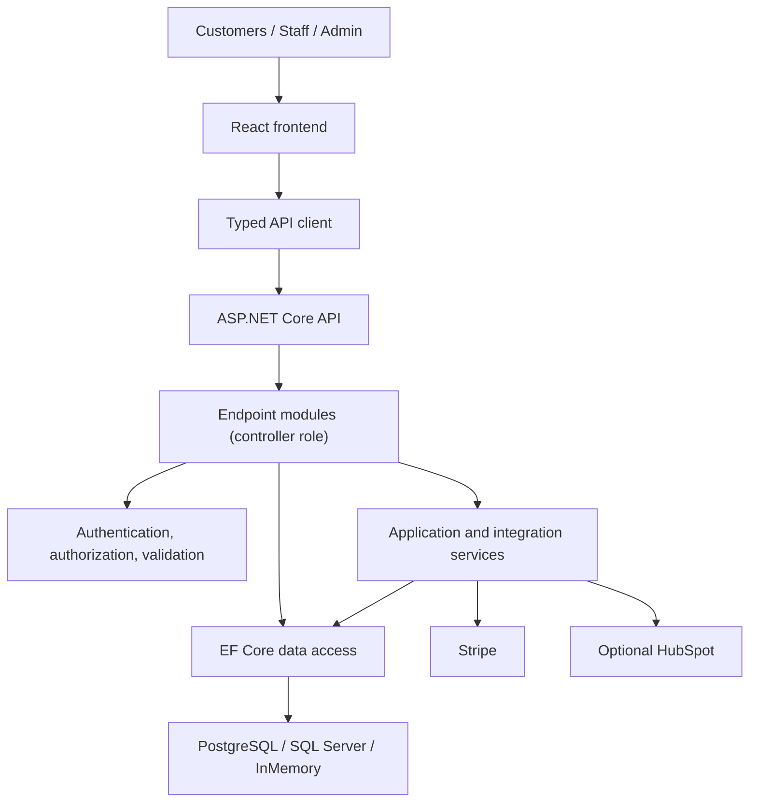

# Ecommerce Demo

[](https://github.com/pancakebaker/dotnet-react-ecommerce-demo/actions/workflows/ci.yml)


## Project Overview

Ecommerce Demo provides a complete storefront and back-office workflow for teams that need to manage products, customers, checkout, payments, and order fulfillment in one application. Public customers can browse a responsive catalog and place orders, while authenticated staff use role-aware management screens for operational work.

The system separates browser concerns from server-owned business decisions. React manages interaction and local cart state; the ASP.NET Core API validates requests, recalculates prices, verifies payments, applies authorization, and persists orders through EF Core. Optional Stripe and HubSpot integrations are isolated behind service interfaces so they can be replaced with deterministic test implementations.

> [!IMPORTANT]
> The repository includes production-oriented boundaries and deployment assets, but a live commerce deployment still requires the security, observability, data-retention, payment, and operational work listed under [Future Improvements](#future-improvements).

## Documentation

- [Architecture and request flows](docs/architecture.md)
- [API reference](docs/api.md)
- [Security, CI/CD, challenges, and roadmap](docs/engineering-notes.md)
- [Testing checklist](docs/testing.md)
- [Deployment notes](docs/DEPLOYMENT.md)
- [Performance notes](docs/performance.md)

## Screenshots


| Checkout flow | Staff login | Staff dashboard | Order status workflow |
| --- | --- | --- | --- |
|  |  |  |  |

## Features

### Storefront and Catalog

- Anonymous product browsing, search, product detail URLs, responsive catalog cards, and SEO metadata.
- Local cart state with quantity controls, calculated estimates, and a multi-step checkout experience.
- Customer and delivery-address validation with an optional Google Maps delivery pin.

### Checkout and Payments

- Card checkout through Stripe Elements and server-created PaymentIntents.
- Cash on delivery with invoice PDF generation.
- Server-owned product lookup, subtotal, tax, discount, and total calculation.
- PaymentIntent verification for status, amount, and currency before card orders are persisted.
- Stable idempotency keys for repeated payment-preparation requests.

### Orders and Administration

- JWT-authenticated dashboard, customer, product, order, and profile workflows.
- Resource/action and editable-field permissions for Staff and Admin roles.
- Customer and product CRUD with search, pagination, validation, and product cache invalidation.
- Order creation, status transitions, activity logging, CSV order exports, and PDF product catalogs.
- Optional HubSpot deal creation and status synchronization.

### Quality and Operations

- Typed frontend API models and normalized API error handling.
- xUnit integration tests, Vitest unit/component tests, and Playwright browser tests.
- GitHub Actions CI, API/frontend Dockerfiles, and Docker Compose database services.
- Configurable PostgreSQL, SQL Server, or in-memory persistence.

## Seeded Local Accounts

| Role | Email | Password |
| --- | --- | --- |
| Admin | `admin@ecommerce-demo.test` | `Password123!` |
| Staff | `staff@ecommerce-demo.test` | `Password123!` |

These credentials are intended only for local development. Replace seeded credentials and JWT secrets before deploying to a shared environment.

## Technology Stack

| Category | Technologies |
| --- | --- |
| Frontend | React 18, TypeScript, Vite, Tailwind CSS, clsx, D3.js |
| Backend | .NET 8, ASP.NET Core minimal APIs, Entity Framework Core |
| Database | PostgreSQL, SQL Server, EF Core in-memory provider for local development and tests |
| Authentication | JWT bearer authentication, PBKDF2-SHA256 password hashing, role and permission policies |
| Payments | Stripe PaymentIntents, Stripe Elements, PaymentElement, cash on delivery |
| Integrations | Optional HubSpot order synchronization, Google Maps delivery location |
| Tooling | npm, .NET CLI, Docker, Docker Compose |
| Testing | xUnit API integration tests, Vitest unit/component tests, Playwright end-to-end tests |
| CI/CD | GitHub Actions build and test workflow; deployment remains environment-specific |

## Architecture



The frontend owns presentation, navigation, and short-lived interaction state. Minimal API endpoint modules perform the controller role by defining routes, authentication requirements, payload handling, and HTTP results. Focused services contain checkout, pricing, mapping, token, and external-integration behavior. EF Core's `AppDbContext` is the persistence boundary and supplies query and unit-of-work behavior.

A separate repository layer is not currently present. At this scale, adding pass-through repositories would duplicate EF Core abstractions without creating a clearer boundary. Use-case-specific repositories or query services can be introduced if persistence requirements become more complex.

See [Architecture and request flows](docs/architecture.md) for login, browsing/cart, payment, and order-creation sequence diagrams.

## Run Locally

Prerequisites:

- .NET 8 SDK
- Node.js 22 or newer
- Optional: Docker, PostgreSQL, or SQL Server

Start the API from the repository root:

```powershell
cd path/to/dotnet-react-ecommerce-demo
dotnet restore
dotnet run --project ./src/EcommerceDemo.Api/EcommerceDemo.Api.csproj --urls http://localhost:5088
```

Start the frontend from the `client` folder in a second terminal:

```powershell
cd path/to/dotnet-react-ecommerce-demo/client
npm ci
npm run dev
```

Open the Vite URL printed in the terminal. By default it is `http://localhost:5173`, and the frontend proxies API calls to `http://127.0.0.1:5088`.

For Lighthouse, production-like bundle checks, or mobile performance review, use a production build instead of the Vite development server:

```powershell
cd path/to/dotnet-react-ecommerce-demo/client
npm run build
npm run preview
```

## Configuration

The API defaults to the EF Core in-memory provider for fast local development. Shared and production environments should use PostgreSQL or SQL Server through environment variables or deployment-provider secrets.

API-side settings belong in backend configuration or host secrets. Frontend `VITE_*` values are public browser build-time values and must not contain private API secrets.

| Setting | Scope | Example |
| --- | --- | --- |
| `Database__Provider` | API secret/config | `Postgres` or `SqlServer` |
| `ConnectionStrings__Postgres` | API secret/config | `Host=...;Database=...;Username=...;Password=...` |
| `ConnectionStrings__SqlServer` | API secret/config | `Server=...;Database=...;User Id=...;Password=...;TrustServerCertificate=True` |
| `Jwt__Issuer` | API config | `EcommerceDemo` |
| `Jwt__Audience` | API config | `EcommerceDemo.Client` |
| `Jwt__Secret` | API secret | Strong secret stored outside source control |
| `Cors__AllowedOrigins__0` | API config | Hosted frontend URL, or local frontend origin such as `http://localhost:4173` |
| `Stripe__SecretKey` | API secret | Stripe secret key such as `sk_test_...` |
| `Stripe__Currency` | API config | `usd` |
| `HubSpot__Enabled` | API config | `true` to sync orders to HubSpot |
| `HubSpot__AccessToken` | API secret | HubSpot private app access token |
| `HubSpot__ObjectType` | API config | `deals` |
| `HubSpot__Pipeline` | API config | Optional HubSpot pipeline internal ID |
| `HubSpot__DealStage` | API config | Default HubSpot deal stage internal ID |
| `HubSpot__StatusDealStages__Submitted` | API config | Optional status-specific HubSpot deal stage internal ID |
| `VITE_API_URL` | Frontend public value | Hosted API base URL |
| `VITE_GOOGLE_MAPS_API_KEY` | Frontend public value | Browser-restricted Google Maps JavaScript API key |
| `VITE_STRIPE_PUBLISHABLE_KEY` | Frontend public value | Stripe publishable key such as `pk_test_...` |

For local API secrets, copy the example development settings file and keep the real file uncommitted:

```powershell
Copy-Item .\src\EcommerceDemo.Api\appsettings.Development.example.json .\src\EcommerceDemo.Api\appsettings.Development.json
```

Then put local API secrets in `src/EcommerceDemo.Api/appsettings.Development.json`:

```json
{
  "Stripe": {
    "SecretKey": "sk_test_your_secret_key",
    "Currency": "usd"
  },
  "HubSpot": {
    "Enabled": false,
    "AccessToken": "pat-na1-your-private-app-token",
    "ObjectType": "deals",
    "Pipeline": "",
    "DealStage": "",
    "StatusDealStages": {
      "Submitted": "",
      "Processing": "",
      "Completed": "",
      "Cancelled": ""
    }
  }
}
```

HubSpot sync is disabled by default. When enabled, the API creates a CRM deal after staff or storefront order creation and updates the same deal when order status changes. HubSpot requires internal pipeline and deal stage IDs for deal stage changes; use values from your HubSpot portal or leave the status mapping blank while testing basic order creation.

For local Vite development, a `.env` file is not required because `/api` calls are proxied to `http://127.0.0.1:5088` by `client/vite.config.ts`.

Copy `client/.env.example` to `client/.env` only when local frontend development needs custom public settings:

```text
VITE_API_URL=https://your-api.example.com
VITE_GOOGLE_MAPS_API_KEY=your-browser-key
VITE_STRIPE_PUBLISHABLE_KEY=pk_test_your_key
```

`Stripe__SecretKey` and `HubSpot__AccessToken` must never be exposed to the Vite client.

When using Stripe test mode, Stripe's standard test card `4242 4242 4242 4242` works with any future expiration date, any CVC, and any postal code.

## Security Notes

- Staff/admin authentication uses signed JWT bearer tokens. Authorization combines role policies with resource/action and editable-field permissions from `shared/permissions.config.json`.
- Passwords are salted and hashed with PBKDF2-SHA256; plaintext passwords are not stored.
- API input validation normalizes text fields, rejects markup/script-like input, enforces length limits, and validates email, phone, SKU, price, stock, password, and order quantity ranges.
- Stripe card data is handled by Stripe Elements. The API creates PaymentIntents with server-calculated totals and verifies PaymentIntent status, amount, and currency before creating storefront orders.
- HubSpot private app tokens and Stripe secret keys are used only by the API and should never be exposed to frontend code.
- Frontend forms mirror key customer validation rules so incomplete emails, short phone numbers, and unsafe data are caught before submission.
- React renders user-entered data as escaped text and avoids raw HTML rendering.
- JWT secrets are rejected in production if they use weak development defaults.
- CORS is restricted to configured frontend origins.
- API responses include security headers such as `X-Content-Type-Options`, `X-Frame-Options`, `Referrer-Policy`, and `Permissions-Policy`.

The project still needs production controls such as managed secret storage, rate limiting, centralized exception handling, audit retention, automated security scanning, and operational monitoring. These are tracked under [recommended future security improvements](docs/engineering-notes.md#recommended-future-security-improvements).

## API Overview

| Method | Endpoint | Purpose | Authentication | Request summary | Response summary |
| --- | --- | --- | --- | --- | --- |
| `GET` | `/health` | Check API availability | Public | None | Service status |
| `POST` | `/api/auth/login` | Authenticate a staff or admin user | Public | Email and password | JWT and user profile |
| `POST` | `/api/auth/register` | Create a staff or admin user | Admin | Name, email, password, role | JWT and user profile |
| `GET` | `/api/storefront/products` | Browse active products | Public | Optional search query | Product list |
| `POST` | `/api/storefront/payments/prepare` | Prepare the selected payment method | Public | Customer, items, payment method | Payment preparation details |
| `POST` | `/api/storefront/orders` | Submit a storefront order | Public | Customer, items, payment reference | Created order |
| `GET/POST/PUT/DELETE` | `/api/customers` | Manage customer records | Staff/Admin by permission | Search or customer payload | Paged, created, or updated customer |
| `GET/POST/PUT/DELETE` | `/api/products` | Manage product records | Staff/Admin by permission | Search or product payload | Paged, created, or updated product |
| `GET/POST` | `/api/orders` | Query or create orders | Staff/Admin by permission | Filters or order items | Paged or created order |
| `PATCH` | `/api/orders/{id}/status` | Change order status | Staff/Admin by permission | New status | `204 No Content` |
| `GET/PUT` | `/api/profile` | Read or update the current profile | Staff/Admin | Updated name fields for `PUT` | Current user profile |

Swagger/OpenAPI is available at `/swagger` in development. See the [API reference](docs/api.md) for endpoint-level authentication and payload summaries.

## CI/CD

GitHub Actions runs on pull requests and pushes to `main`. The current pipeline restores and builds the .NET API, runs xUnit tests with coverage collection, installs frontend dependencies, runs Vitest and Playwright, and creates the production Vite build.

| Stage | Current behavior |
| --- | --- |
| Dependency restore | `dotnet restore` and `npm ci` |
| Backend build | Release configuration with restore disabled after the restore stage |
| Backend tests | xUnit tests with XPlat coverage collection |
| Frontend tests | Vitest unit/component tests and Playwright browser tests |
| Frontend build | TypeScript validation followed by the Vite production build |
| Linting | No standalone frontend lint script is currently configured |
| Publish/deploy | Environment-specific; not automated by the current workflow |

The workflow does not currently include a standalone frontend lint command, artifact publication, or automated deployment. The Dockerfiles package the API and static frontend, while [deployment notes](docs/DEPLOYMENT.md) describe runtime configuration. Dependency review, secret scanning, image scanning, artifact publishing, environment approvals, deployment, and rollback automation remain roadmap work.

## Tests

Backend build and API/integration tests:

```powershell
dotnet build
dotnet test
```

Frontend unit/component tests, browser tests, and production build:

```powershell
cd client
npm test
npm run test:e2e
npm run build
```

The automated test environment uses test doubles for Stripe/HubSpot paths where applicable, so tests should not call real Stripe APIs or require real payment secrets.

Refresh README screenshots when the frontend dev or preview server is running locally. The screenshot script mocks API responses for stable output:

```powershell
cd path/to/dotnet-react-ecommerce-demo/client
npm run screenshots:readme
```

Use `SCREENSHOT_BASE_URL` if the frontend is running on a different URL:

```powershell
$env:SCREENSHOT_BASE_URL="http://127.0.0.1:4173"
npm run screenshots:readme
```

## Docker

Build the API image:

```powershell
docker build -f src/EcommerceDemo.Api/Dockerfile -t ecommerce-demo-api .
```

Build the frontend image:

```powershell
docker build -f client/Dockerfile `
  --build-arg VITE_API_URL=https://your-api.example.com `
  --build-arg VITE_GOOGLE_MAPS_API_KEY=your-browser-key `
  --build-arg VITE_STRIPE_PUBLISHABLE_KEY=pk_test_your_key `
  -t ecommerce-demo-client .
```

`docker-compose.yml` includes local PostgreSQL and SQL Server services for database testing.

## Deployment Notes

Recommended deployment topology:

- Deploy `src/EcommerceDemo.Api` to Azure App Service, Render, Railway, Fly.io, or any container host.
- Deploy `client` to Netlify, Vercel, Azure Static Web Apps, Render static site, or nginx container hosting.
- Use PostgreSQL or SQL Server for persistence.
- Store JWT secrets, Stripe secret keys, HubSpot tokens, and database connection strings as backend environment variables or host secrets.
- Set `Cors__AllowedOrigins__0` to the hosted frontend URL.
- Set `VITE_API_URL` to the hosted API URL before building the frontend.
- Set `VITE_GOOGLE_MAPS_API_KEY` to a browser-restricted Google Maps key if the checkout delivery pin should be enabled.
- Set `VITE_STRIPE_PUBLISHABLE_KEY` to a Stripe publishable key if card payment should be enabled in the browser.
- Configure `Stripe__SecretKey` only on the API host. Use Stripe test keys until production payment configuration and review are complete.
- Configure `HubSpot__Enabled=true`, `HubSpot__AccessToken`, and HubSpot pipeline/stage IDs on the API host only when orders should sync to HubSpot.

## Repository Structure

```text
src/EcommerceDemo.Api/
|-- Data/                         EF Core context and seed data
|-- Domain/                       Persisted entities and domain constants
|-- Dtos/                         API request and response contracts
|-- Endpoints/                    Routes, authorization, and HTTP orchestration
|-- Services/                     Business rules and external integrations
|-- Validation/                   Input normalization and payload enforcement
tests/EcommerceDemo.Api.Tests/    xUnit unit and API integration tests
client/src/
|-- app/                          Application shell and navigation
|-- components/                   Reusable UI, form, table, and chart components
|-- features/                     Workflow-owned screens, hooks, and helpers
|-- models/                       Shared TypeScript contracts
|-- services/                     Typed API client and error normalization
|-- permissions/                 Client-side permission-aware presentation
client/e2e/                       Playwright browser tests
docs/                             Architecture, API, operations, and screenshots
.github/workflows/                Continuous integration workflows
docker-compose.yml                Local PostgreSQL and SQL Server services
```

This organization keeps HTTP, business, persistence, and presentation responsibilities distinct. Workflow code stays close to the feature that owns it, while shared contracts and reusable components remain centralized. The structure can grow incrementally without requiring every feature to adopt abstractions it does not yet need.

## AI-Assisted Development

AI tools may be used to support planning, refactoring proposals, documentation, debugging, test-case generation, and code review. All AI-generated code and documentation are treated as drafts: a developer reviews each change, validates claims against the repository, runs relevant automated checks, and remains responsible for security, correctness, and maintainability.

## Challenges and Solutions

| Area | Problem | Solution | Trade-off | Result |
| --- | --- | --- | --- | --- |
| API boundaries | HTTP handlers can accumulate validation, pricing, and integration logic. | Keep transport concerns in endpoint modules and move cohesive behavior into focused services. | Some simple CRUD handlers still access `AppDbContext` directly. | Business-heavy flows remain independently testable without unnecessary layers. |
| Authentication | Public and protected workflows share one application. | Issue JWTs after PBKDF2 credential verification and enforce API role/permission policies. | Browser token storage has a larger XSS impact than an HttpOnly cookie design. | Stateless API authorization with explicit production hardening work documented. |
| Payments | Browser-reported totals and payment state cannot be trusted. | Recalculate totals server-side and verify PaymentIntent status, amount, and currency. | Payment webhooks and asynchronous reconciliation are not yet implemented. | Card orders are created only after synchronous provider verification. |
| Configuration | Local defaults must not become production configuration accidentally. | Use environment-based settings and fail fast on weak production JWT or in-memory database settings. | Deployment platforms still need correct secret and configuration management. | Local setup stays simple while unsafe production defaults are rejected. |
| Persistence | A repository abstraction can duplicate EF Core without adding value. | Use `AppDbContext` directly at the application boundary and isolate complex workflows in services. | Endpoint modules remain coupled to EF Core queries. | Fewer pass-through abstractions and a clear path to add use-case repositories later. |

Additional implementation decisions are documented in [Engineering Notes](docs/engineering-notes.md#challenges-and-solutions).

## Future Improvements

- Add managed secret storage, automated secret scanning, rate limiting, and login abuse protections.
- Add centralized exception handling, structured logs, distributed tracing, metrics, dashboards, and alerts.
- Add Stripe webhook verification and asynchronous payment reconciliation.
- Add EF Core migrations, backup/restore procedures, and production data-retention policies.
- Add inventory reservation and optimistic concurrency for competing purchases.
- Add background jobs and retry policies for HubSpot synchronization.
- Add explicit frontend linting, security scanning, artifact publication, deployment environments, and rollback automation.
- Expand automated permission, accessibility, failure-path, and browser coverage.
- Add distributed caching and horizontal-scaling support when multiple API instances are required.
