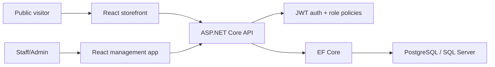

# Ecommerce Demo

[](https://github.com/pancakebaker/dotnet-react-ecommerce-demo/actions/workflows/ci.yml)

Ecommerce Demo is a full-stack ecommerce ordering demo. It combines a public storefront, cart checkout, customer capture, staff/admin operations, JWT authentication, role-based authorization, EF Core persistence, automated tests, Docker packaging, and GitHub Actions CI.

This project is under ongoing development and is intended for demo and learning purposes. It is not a production ecommerce platform without additional hardening, operational review, and security work.

The project is intentionally compact while still showing the moving parts of a production-style ecommerce application: clear API boundaries, typed frontend development, role-aware workflows, test coverage, deployment configuration, and a user-facing flow that can be reviewed quickly.

## Screenshots


| Checkout flow | Staff login | Staff dashboard | Order status workflow |
| --- | --- | --- | --- |
|  |  |  |  |

## What You Can Try

- Browse active products on an SEO-friendly public storefront.
- Add products to a cart, move through checkout steps, enter validated customer details, and place an order.
- Sign in as staff/admin and review dashboard metrics, customers, products, orders, and profile details.
- Update order statuses and see activity reflected in dashboard data.
- Export orders to CSV and products to a styled PDF catalog.
- Run backend and frontend tests from a clean checkout.

## Demo Accounts

| Role | Email | Password |
| --- | --- | --- |
| Admin | `admin@ecommerce-demo.test` | `Password123!` |
| Staff | `staff@ecommerce-demo.test` | `Password123!` |

These accounts are seeded only for demonstration. Replace credentials and JWT secrets before adapting this project for non-demo use.

## Tech Stack

| Area | Tools |
| --- | --- |
| Backend | ASP.NET Core Web API, EF Core, JWT bearer authentication |
| Database | PostgreSQL or SQL Server by configuration, in-memory provider for quick demos |
| Frontend | React, TypeScript, Vite, Tailwind CSS, D3.js |
| Testing | xUnit API integration tests, Vitest component/unit tests, Playwright end-to-end tests |
| DevOps | GitHub Actions, Dockerfiles, Docker Compose |

## Architecture



## Feature Highlights

- Public storefront with 10 seeded products and a focused cart, customer details, review, and order placement checkout flow.
- Google Maps delivery pin in checkout that reverse-geocodes pin moves into the address field and geocodes address edits back onto the pin.
- SEO metadata, Open Graph/Twitter tags, structured data, valid `robots.txt`, favicon, responsive WebP/JPEG images, and no-JavaScript fallback content.
- JWT login/register with protected API routes, Admin/Staff authorization, and a staff login password visibility toggle.
- Dashboard metrics and D3 visualizations for order momentum, product stock, revenue, and recent activity.
- Customer CRUD with search, pagination, full contact fields, and client/server validation for email, phone, length limits, and unsafe input.
- Product CRUD with SKU, price, stock quantity, and active/inactive status.
- Order creation with line items, subtotal, tax, discount, total calculation, status workflow, and activity logs.
- Staff-friendly exports for order CSV reporting and styled product PDF catalogs.
- xUnit tests for authentication, authorization, customer, product, order, and anonymous storefront checkout paths.
- Vitest coverage for frontend formatting, validation helpers, and component behavior.
- Playwright e2e coverage for storefront checkout, customer validation, authenticated order status scanning, and exports.
- Configurable database provider and CORS origins for local or hosted deployments.

## Run Locally

Prerequisites:

- .NET 8 SDK
- Node.js 22 or newer
- Optional: Docker, PostgreSQL, or SQL Server

Start the API from the repository root:

```powershell
cd path/to/dotnet-react-ecommerce-demo
dotnet restore
dotnet run --project ./src/EcommerceDemo.Api/EcommerceDemo.Api.csproj --urls http://localhost:5088
```

Start the frontend from the `client` folder in a second terminal:

```powershell
cd path/to/dotnet-react-ecommerce-demo/client
npm ci
npm run dev
```

Open the Vite URL printed in the terminal. By default it is `http://localhost:5173`, and the frontend proxies API calls to `http://127.0.0.1:5088`.

For Lighthouse or mobile performance checks, use a production build instead of the Vite development server:

```powershell
cd path/to/dotnet-react-ecommerce-demo/client
npm run build
npm run preview
```

## Configuration

The API defaults to `InMemory` for fast local review. For a hosted demo, use PostgreSQL or SQL Server via environment variables or deployment-provider secrets.

| Setting | Example |
| --- | --- |
| `Database__Provider` | `Postgres` or `SqlServer` |
| `ConnectionStrings__Postgres` | `Host=...;Database=...;Username=...;Password=...` |
| `ConnectionStrings__SqlServer` | `Server=...;Database=...;User Id=...;Password=...;TrustServerCertificate=True` |
| `Jwt__Issuer` | `EcommerceDemo` |
| `Jwt__Audience` | `EcommerceDemo.Client` |
| `Jwt__Secret` | Strong secret stored outside source control |
| `Cors__AllowedOrigins__0` | Hosted frontend URL |
| `VITE_GOOGLE_MAPS_API_KEY` | Browser-restricted Google Maps JavaScript API key |

For local Vite development, a `.env` file is not required because `/api` calls are proxied to `http://127.0.0.1:5088` by `client/vite.config.ts`.

Frontend production builds can set `VITE_API_URL` to point at a hosted API and `VITE_GOOGLE_MAPS_API_KEY` to enable the checkout delivery pin. Copy `client/.env.example` to `client/.env` for local experiments that need custom frontend settings:

```text
VITE_API_URL=https://your-api.example.com
VITE_GOOGLE_MAPS_API_KEY=your-browser-key
```

## Security Notes

- API input validation normalizes text fields, rejects markup/script-like input, enforces length limits, and validates email domains, phone numbers, SKU, price, stock, password, and order quantity ranges.
- Frontend forms mirror key customer validation rules so incomplete emails, short phone numbers, and unsafe data are caught before submission.
- React renders user-entered data as escaped text and avoids raw HTML rendering.
- JWT secrets are rejected in production if they use weak demo values.
- CORS is restricted to configured frontend origins.
- API responses include security headers such as `X-Content-Type-Options`, `X-Frame-Options`, `Referrer-Policy`, and `Permissions-Policy`.

## API Highlights

- `GET /health`
- `GET /api/storefront/products`
- `POST /api/storefront/orders`
- `POST /api/auth/register`
- `POST /api/auth/login`
- `GET /api/dashboard/summary`
- `GET|POST|PUT|DELETE /api/customers`
- `GET|POST|PUT|DELETE /api/products`
- `GET|POST /api/orders`
- `PATCH /api/orders/{id}/status`
- `GET|PUT /api/profile`

Swagger is available at `/swagger` in development.

## Tests

```powershell
dotnet test --configuration Release

cd client
npm test
npm run test:e2e
npm run build
```

Refresh README screenshots when the frontend dev or preview server is running locally. The script mocks API responses for stable screenshots:

```powershell
cd path/to/dotnet-react-ecommerce-demo/client
npm run screenshots:readme
```

Use `SCREENSHOT_BASE_URL` if the frontend is running on a different URL:

```powershell
$env:SCREENSHOT_BASE_URL="http://127.0.0.1:4173"
npm run screenshots:readme
```

## Docker

Build the API image:

```powershell
docker build -f src/EcommerceDemo.Api/Dockerfile -t ecommerce-demo-api .
```

Build the frontend image:

```powershell
docker build -f client/Dockerfile --build-arg VITE_API_URL=https://your-api.example.com -t ecommerce-demo-client .
```

`docker-compose.yml` includes local PostgreSQL and SQL Server services for database testing.

## Deployment Notes

Recommended hosted demo shape:

- Deploy `src/EcommerceDemo.Api` to Azure App Service, Render, Railway, Fly.io, or any container host.
- Deploy `client` to Netlify, Vercel, Azure Static Web Apps, Render static site, or nginx container hosting.
- Use PostgreSQL or SQL Server for persistence.
- Store JWT secrets and connection strings as environment variables.
- Set `Cors__AllowedOrigins__0` to the hosted frontend URL.
- Set `VITE_API_URL` to the hosted API URL and `VITE_GOOGLE_MAPS_API_KEY` to a browser-restricted Google Maps key before building the frontend.

## Project Layout

```text
src/EcommerceDemo.Api             ASP.NET Core API
tests/EcommerceDemo.Api.Tests     xUnit integration tests
client                            React TypeScript application
client/src/app                    App shell and navigation configuration
client/src/features               Screen-level React features by workflow
client/src/components             Shared presentational components
client/src/services               API client and external service adapters
client/src/models                 Shared TypeScript domain models
client/src/helpers                Formatting and UI helper utilities
client/e2e                        Playwright browser tests
client/scripts                    Utility scripts for project assets
.github/workflows                 CI pipeline
docker-compose.yml                Local database services
```

## Design Goals

Ecommerce Demo is intentionally scoped to show end-to-end product thinking without hiding behind boilerplate. It has public and authenticated user journeys, real order calculations, role-specific behavior, persistence concerns, API tests, frontend tests, CI, deployment configuration, and documentation that explains operational tradeoffs.
