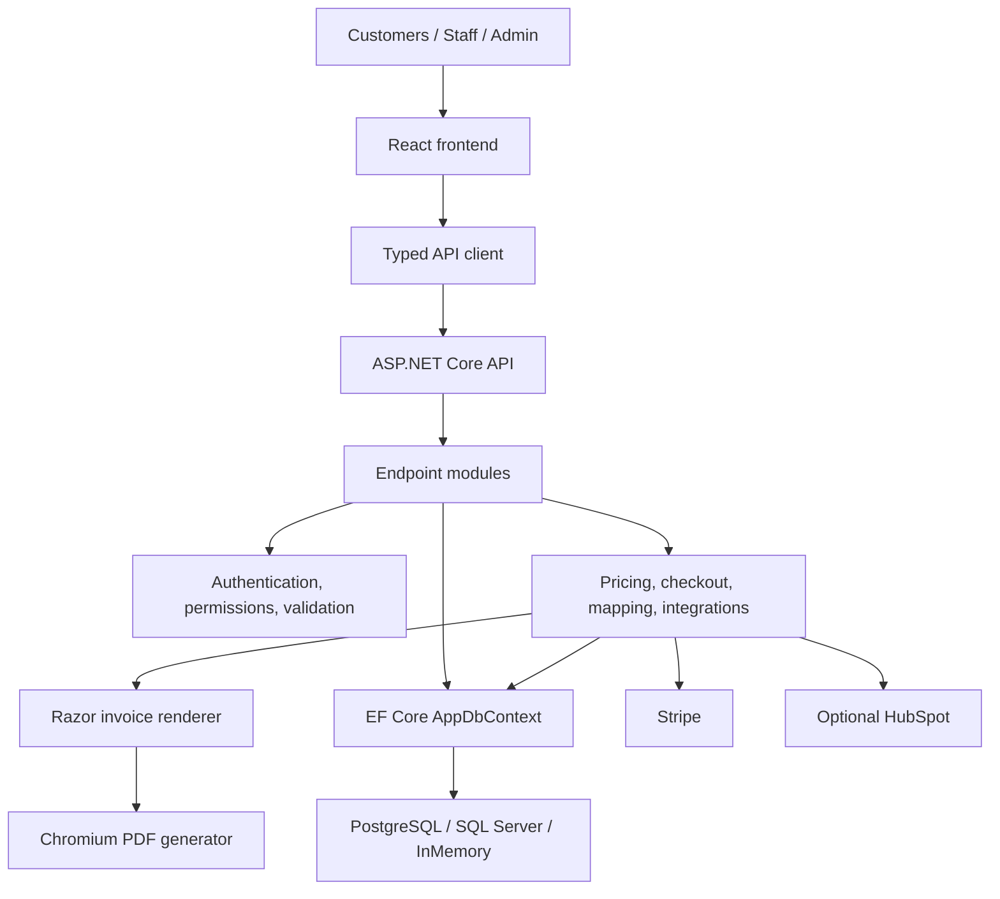
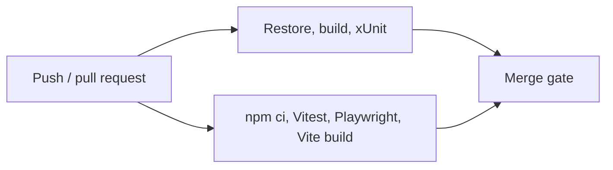

# Commerce Platform

[](https://github.com/pancakebaker/dotnet-react-ecommerce-demo/actions/workflows/ci.yml)


## Project Overview

Commerce Platform provides public storefront and back-office workflows for product discovery, checkout, payment, customer management, and order fulfillment. Customers can browse products and place orders, while authenticated staff manage operational data through permission-aware screens.

The React frontend owns presentation and short-lived interaction state. The ASP.NET Core API owns validation, authorization, pricing, payment verification, and persistence. Stripe and HubSpot integrations are isolated behind services so external dependencies can be replaced during automated testing.

> [!IMPORTANT]
> The repository contains production-oriented boundaries and deployment assets, but operating it with real customer and payment data requires the controls listed in [Known Limitations](docs/known-limitations.md) and the [Roadmap](#roadmap).

## Documentation

| Topic | Document |
| --- | --- |
| Architecture and request flows | [Architecture](docs/architecture.md) |
| Business invariants | [Business Rules](docs/business-rules.md) |
| API endpoints | [API Reference](docs/api.md) |
| Threats and security controls | [Security and Threat Model](docs/security.md) |
| Runtime responsibilities | [Operational Considerations](docs/operations.md) |
| Performance behavior | [Performance Characteristics](docs/performance.md) |
| Current scope boundaries | [Known Limitations](docs/known-limitations.md) |
| Engineering trade-offs and roadmap | [Engineering Notes](docs/engineering-notes.md) |
| Testing expectations | [Testing](docs/testing.md) |
| Deployment configuration | [Deployment](docs/DEPLOYMENT.md) |
| Change delivery | [Release Process](docs/release-process.md) |
| Architecture decisions | [ADR Index](docs/adr/README.md) |
| Contributions | [Contributing](CONTRIBUTING.md) |

## Features

### Storefront and Checkout

- Anonymous product browsing, search, product detail routes, and responsive catalog layouts.
- Cart quantity management and customer/delivery-address validation.
- Stripe Elements card checkout and cash on delivery.
- Server-owned product lookup, pricing, tax calculation, and payment verification.
- Optional Google Maps delivery-pin support.

### Operations

- JWT-authenticated dashboard, customer, product, order, and profile workflows.
- Staff/Admin resource, action, and editable-field permissions.
- Customer and product management with search and bounded pagination.
- Order creation, status updates, activity logs, CSV exports, and PDF generation.
- Authenticated server-generated invoice PDFs rendered from Razor templates.
- Optional HubSpot deal creation and status synchronization.

### Engineering

- PostgreSQL, SQL Server, or in-memory EF Core persistence by configuration.
- Typed frontend contracts and centralized API error normalization.
- xUnit, Vitest, and Playwright automated coverage.
- GitHub Actions CI, Dockerfiles, and Docker Compose database services.

## Platform Overview

| Category | Technologies |
| --- | --- |
| Frontend | React 18, TypeScript, Vite, Tailwind CSS, D3.js |
| Backend | .NET 8, ASP.NET Core minimal APIs, Razor templates, Entity Framework Core |
| Data | PostgreSQL, SQL Server, EF Core in-memory provider |
| Identity | JWT bearer authentication, PBKDF2-SHA256 password hashing |
| Payments | Stripe PaymentIntents, Stripe Elements, cash on delivery |
| Integrations | Optional HubSpot synchronization and Google Maps |
| Testing | xUnit, Vitest, Testing Library, Playwright |
| Documents | Razor invoice templates, PuppeteerSharp/Chromium PDF rendering, client-side jsPDF exports |
| Delivery | GitHub Actions, Docker, Docker Compose, nginx |

## Architecture



Minimal API endpoint modules perform the controller role. They define routes, authorization, payload handling, and HTTP results. Focused services contain business-heavy and integration behavior. EF Core's `AppDbContext` is the persistence boundary; pass-through repositories are intentionally avoided until a use case needs a stronger abstraction.

See [Architecture](docs/architecture.md) and the [ADR index](docs/adr/README.md) for detailed flows and decisions.

### PDF and Document Generation

Authenticated order invoices are generated server-side from persisted order data. `InvoiceViewModel` separates document data from the domain entity, an ASP.NET Core Razor template produces semantic print HTML, and PuppeteerSharp converts that HTML to PDF through Chromium. Razor is used instead of React because invoices are server-owned documents and must not depend on browser state or client-provided totals.

The existing React/jsPDF exports remain available for storefront cash-on-delivery invoices and product catalogs; the React application itself is not replaced by Razor.

## Design Principles

- **Separation of concerns:** transport, business, persistence, and UI responsibilities have explicit boundaries.
- **Thin API endpoints:** endpoint modules orchestrate requests while reusable rules live in focused services.
- **Server-owned decisions:** prices, totals, permissions, and payment state are never trusted from the browser.
- **Explicit validation:** request contracts, allowed fields, lengths, ranges, and identifiers are checked at the API boundary.
- **Secure defaults:** production rejects weak JWT secrets and in-memory persistence.
- **Environment-based configuration:** credentials and environment-specific values stay outside source control.
- **Testability:** payment and CRM interfaces use deterministic implementations in the test environment.
- **Maintainability:** abstractions are introduced when they remove real complexity, not preemptively.
- **Clear client/server boundaries:** frontend permission checks improve usability; API checks remain authoritative.

## Local Development

Prerequisites:

- .NET 8 SDK
- Node.js 22 or newer
- Optional: Docker, PostgreSQL, or SQL Server

Start the API from the repository root:

```powershell
dotnet restore
dotnet run --project ./src/EcommerceDemo.Api/EcommerceDemo.Api.csproj --urls http://localhost:5088
```

Start the frontend from `client` in a second terminal:

```powershell
cd client
npm ci
npm run dev
```

The frontend defaults to `http://localhost:5173` and proxies `/api` requests to `http://127.0.0.1:5088`.

Seeded local accounts:

| Role | Email | Password |
| --- | --- | --- |
| Admin | `admin@ecommerce-demo.test` | `Password123!` |
| Staff | `staff@ecommerce-demo.test` | `Password123!` |

These credentials are for local development only. Replace seeded credentials and JWT settings before using a shared environment.

## Configuration

The API defaults to in-memory persistence locally. Shared environments should use PostgreSQL or SQL Server.

| Setting | Scope | Purpose |
| --- | --- | --- |
| `Database__Provider` | API | `Postgres`, `SqlServer`, or local `InMemory` |
| `ConnectionStrings__Postgres` | API secret | PostgreSQL connection |
| `ConnectionStrings__SqlServer` | API secret | SQL Server connection |
| `Jwt__Issuer` / `Jwt__Audience` | API | Token validation |
| `Jwt__Secret` | API secret | JWT signing key |
| `Cors__AllowedOrigins__0` | API | Allowed frontend origin |
| `Stripe__SecretKey` | API secret | Stripe server credential |
| `Stripe__Currency` | API | Payment currency |
| `InvoicePdf__BrowserExecutablePath` | API | Chrome/Chromium executable used for PDF rendering |
| `InvoicePdf__AllowBrowserDownload` | API | Allows PuppeteerSharp to download a managed browser when no executable is found |
| `InvoicePdf__DisableSandbox` | API | Container-only Chromium compatibility option |
| `HubSpot__Enabled` | API | Enables CRM synchronization |
| `HubSpot__AccessToken` | API secret | HubSpot private app credential |
| `VITE_API_URL` | Frontend public value | Hosted API URL |
| `VITE_GOOGLE_MAPS_API_KEY` | Frontend public value | Browser-restricted Maps key |
| `VITE_STRIPE_PUBLISHABLE_KEY` | Frontend public value | Stripe publishable key |

Copy the API settings template for local secrets:

```powershell
Copy-Item .\src\EcommerceDemo.Api\appsettings.Development.example.json `
  .\src\EcommerceDemo.Api\appsettings.Development.json
```

`appsettings.Development.json` and `.env` are ignored by Git. Values prefixed with `VITE_` are embedded in browser builds and must never contain private credentials.

## Security

Implemented controls include JWT validation, role/action/field permissions, PBKDF2 password hashing, input validation, configured CORS, HTTPS/HSTS outside development and testing, baseline response security headers, and server-side Stripe verification.

Raw card data is handled by Stripe Elements and does not pass through the API. Private Stripe and HubSpot credentials remain server-side.

Invoice HTML is rendered on the API from persisted order/customer records. Razor encodes dynamic values, totals are loaded from the server-owned order, and payment reference IDs are not included in the template or response metadata.

See [Security and Threat Model](docs/security.md) for assets, threats, existing mitigations, and required future controls.

## API Overview

| Method | Endpoint | Purpose | Authentication |
| --- | --- | --- | --- |
| `GET` | `/health` | Service health | Public |
| `POST` | `/api/auth/login` | Issue JWT and user profile | Public |
| `POST` | `/api/auth/register` | Create a staff/admin user | Admin |
| `GET` | `/api/storefront/products` | Browse active products | Public |
| `POST` | `/api/storefront/payments/prepare` | Prepare checkout payment | Public |
| `POST` | `/api/storefront/orders` | Submit storefront order | Public |
| `GET/POST/PUT/DELETE` | `/api/customers` | Manage customers | Staff/Admin by permission |
| `GET/POST/PUT/DELETE` | `/api/products` | Manage products | Staff/Admin by permission |
| `GET/POST` | `/api/orders` | Query or create orders | Staff/Admin by permission |
| `GET` | `/api/orders/{id}/invoice` | Download server-generated invoice PDF | Staff/Admin by permission |
| `PATCH` | `/api/orders/{id}/status` | Update order status | Staff/Admin by permission |
| `GET/PUT` | `/api/profile` | Manage current profile | Staff/Admin |

Swagger/OpenAPI is available at `/swagger` in Development. See the [API Reference](docs/api.md) for request and response details.

## Testing

```powershell
dotnet build --configuration Release
dotnet test --configuration Release

cd client
npm test
npm run test:e2e
npm run build
```

API tests use in-memory persistence and test implementations for Stripe and HubSpot. See [Testing](docs/testing.md) for regression expectations.

## CI/CD

GitHub Actions runs on pull requests and pushes to `main`.



The workflow does not currently publish artifacts or deploy environments. See [Release Process](docs/release-process.md) and [Operational Considerations](docs/operations.md).

## Deployment

The intended topology is a separately hosted ASP.NET Core API and static React application backed by PostgreSQL or SQL Server. API and frontend Dockerfiles are included; `docker-compose.yml` provides local database services.

Store API credentials in the hosting platform's secret manager, set CORS to the exact frontend origin, and inject public Vite values during the frontend build. See [Deployment](docs/DEPLOYMENT.md).

## Repository Structure

```text
src/EcommerceDemo.Api/
|-- Data/                         EF Core context and seed data
|-- Domain/                       Entities and domain constants
|-- Dtos/                         API request/response contracts
|-- Endpoints/                    Routes and HTTP orchestration
|-- Services/                     Business rules and integrations
|   `-- Invoices/                 Razor rendering and PDF generation
|-- Templates/
|   `-- Invoices/Invoice.cshtml   Print-friendly invoice template
|-- Validation/                   Input and payload enforcement
tests/EcommerceDemo.Api.Tests/    xUnit unit and integration tests
client/src/
|-- app/                          Application shell and navigation
|-- components/                   Shared UI and form components
|-- features/                     Workflow-owned screens and logic
|-- models/                       Shared TypeScript contracts
|-- services/                     API client and error handling
|-- permissions/                 Permission-aware presentation
client/e2e/                       Playwright browser tests
docs/                             Engineering and operational documentation
.github/workflows/                Continuous integration
```

## Non-Goals

The current scope does not include:

- marketplace or multi-vendor settlement;
- warehouse management or fulfillment optimization;
- advanced inventory reservation;
- full payment reconciliation and webhook processing;
- localization or multi-currency catalog management;
- distributed caching or multi-region operation.

See [Known Limitations](docs/known-limitations.md) for implementation-specific constraints.

## Roadmap

- Add Stripe webhook verification and asynchronous payment reconciliation.
- Add inventory reservation and optimistic concurrency.
- Add managed migrations, backup validation, and recovery procedures.
- Add centralized exception handling, structured logs, metrics, traces, alerts, and error reporting.
- Add rate limiting, login abuse protection, secret scanning, SAST, and container scanning.
- Add distributed caching and horizontal-scaling support.
- Add explicit frontend linting, artifact publication, deployment environments, and rollback automation.
- Expand permission, accessibility, failure-path, and browser coverage.
- Add invoice template versioning and document retention policy if generated invoices become regulated records.

## License

Licensed under the [MIT License](LICENSE).
