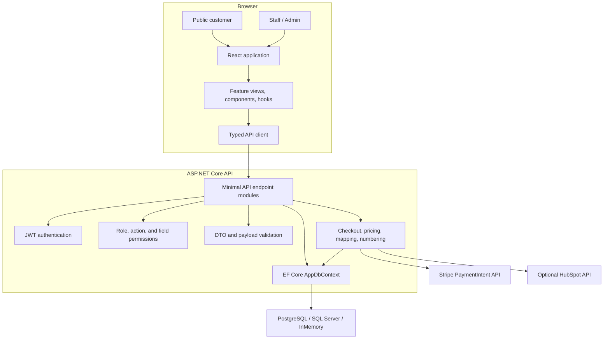
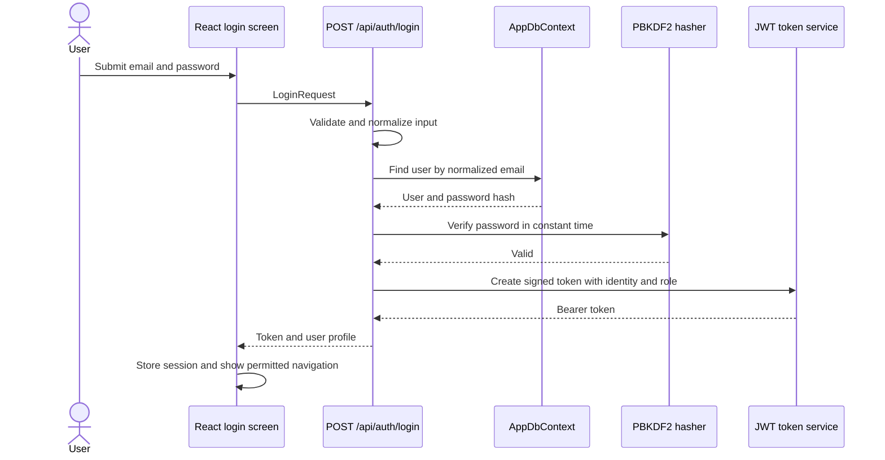
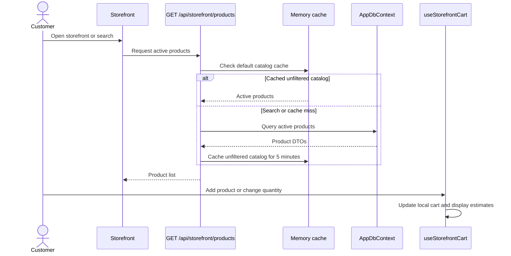
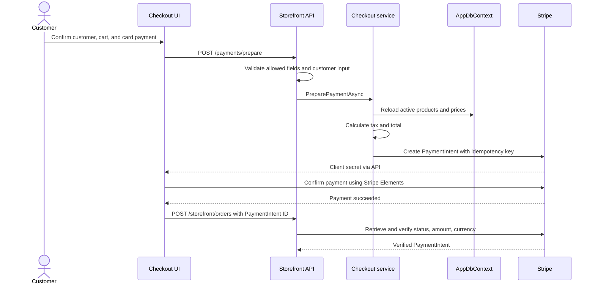
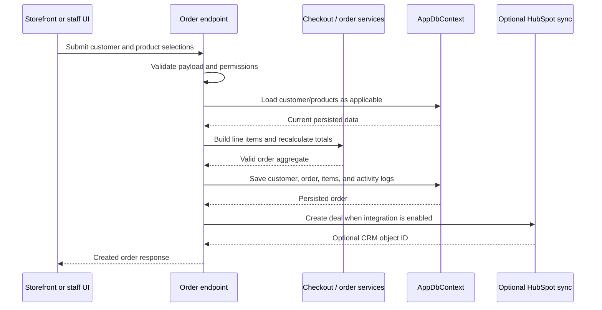

# Architecture and Request Flows

This document is designed for a short technical walkthrough. It describes the code that exists today and calls out deliberate simplifications.

## System Architecture



The API is organized by endpoint modules instead of MVC controllers. Endpoint handlers own routing and HTTP results, while services hold reusable business and integration logic. EF Core's `AppDbContext` is the data-access boundary; a separate repository layer is not currently necessary and would add indirection without removing meaningful complexity.

## Login Flow



The browser includes the token in the `Authorization` header for protected calls. The API remains the authorization authority; hiding navigation in React is only a usability measure.

## Product Browsing and Cart Flow



The cart is browser state for responsiveness. At checkout, the API reloads active products and recalculates totals from server-side prices, so client totals are never authoritative.

## Checkout and Payment Flow



Stripe Elements handles card details directly. The frontend receives a publishable client secret; the API secret key stays on the server.

## Order Creation Flow



Storefront card orders add payment verification before persistence. Staff-created orders require JWT authentication and configured resource permissions.

## Backend Structure

```text
src/EcommerceDemo.Api/
|-- Data/          EF Core context and demo seeding
|-- Domain/        Entities, order statuses, and domain state
|-- Dtos/          Explicit API request and response contracts
|-- Endpoints/     Route groups, HTTP orchestration, authorization
|-- Services/      Checkout, pricing, auth, mapping, and integrations
|-- Validation/    Input normalization and allowed-field enforcement
|-- Program.cs     Dependency injection, middleware, auth, and startup
```

- `Endpoints` play the controller role and remain grouped by API resource.
- `Services` isolate reusable business rules and external integrations from HTTP transport details.
- `Data` centralizes persistence configuration. EF Core provides change tracking, querying, and the unit of work.
- `Dtos` prevent persistence entities from becoming the public API contract.
- `Domain` represents persisted ecommerce concepts and relationships.
- `Validation` provides shared server-side trust-boundary checks.
- Middleware configured in `Program.cs` applies security headers, HTTPS behavior, CORS, authentication, and authorization.

## Frontend Structure

```text
client/src/
|-- app/           Application shell, navigation, and shared app styles
|-- components/    Reusable UI, forms, tables, charts, and loading states
|-- features/      Workflow-focused screens, components, hooks, and helpers
|-- helpers/       Cross-feature formatting, exports, validation, and PDFs
|-- models/        Shared TypeScript API and UI types
|-- permissions/   Client-side permission-aware presentation
|-- services/      Typed HTTP API client and error normalization
|-- test/          Shared Vitest setup
|-- main.tsx       Browser entry point
```

Feature folders keep checkout, storefront, dashboard, orders, products, customers, authentication, and profile code close to the workflow that owns it. Shared components and models reduce duplication, while hooks separate stateful behavior from presentation. The project uses a small app shell rather than a routing or global-state framework because its current navigation and state needs remain modest.

## Maintainability and Scaling

- Clear HTTP, business, persistence, and UI boundaries make focused tests possible.
- Server-owned pricing and authorization keep trust decisions out of the browser.
- Interfaces around payment and HubSpot integrations allow deterministic test doubles.
- Feature folders make new workflow-specific components easy to add without expanding a global component directory.
- If query complexity or multiple persistence mechanisms grow, dedicated query/repository abstractions can be introduced around specific use cases rather than added preemptively.
