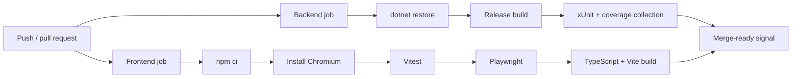

# Engineering Notes

These notes capture the implementation decisions that are useful in a technical interview, along with the work still required before treating the demo as a production commerce platform.

## Security

### Implemented Controls

- **Authentication:** JWT bearer tokens are issued after credential verification. Tokens include user identity and role claims and are validated for issuer, audience, lifetime, and signing key.
- **Authorization:** Protected route groups require Staff or Admin. Endpoint filters apply resource/action permissions, and allowed request fields are checked against `shared/permissions.config.json`.
- **Passwords:** Passwords are salted and hashed with PBKDF2-SHA256 using 100,000 iterations. Verification uses a fixed-time comparison.
- **Input validation:** The API normalizes and validates authentication, customer, product, search, payment, and order inputs. Storefront payload readers reject unexpected fields.
- **Error handling:** Validation and expected integration failures return controlled problem responses. The frontend avoids displaying raw 5xx response details.
- **Secret management:** Real development settings and `.env` files are ignored by Git. Production secrets are expected through environment variables or host secret stores. Vite variables are treated as public.
- **Payment handling:** Stripe Elements collects card data, so raw card details do not pass through the React app or API. The API creates and verifies PaymentIntents using server-calculated amount and currency.
- **Browser/API controls:** Configured CORS origins, HTTPS/HSTS outside development/testing, and baseline security headers reduce common exposure.
- **Data minimization:** Payment and HubSpot reference fields are excluded from general permission-based response visibility.

These controls are OWASP-aware, especially around authentication, authorization, validation, secret separation, output safety, and secure configuration. They are not a substitute for a production threat model or security assessment.

### Recommended Future Security Improvements

- Store production secrets in a managed vault and add automated secret scanning.
- Add API rate limiting and login abuse protections.
- Add centralized exception handling with correlation IDs and structured security logging.
- Define token revocation/rotation and shorter-lived access-token strategy.
- Add account lockout, password reset, and optional multi-factor authentication.
- Review Content Security Policy requirements for the separately hosted React and Stripe experiences.
- Add dependency, SAST, container, and dynamic security scanning to CI.
- Add Stripe webhook verification for authoritative asynchronous payment lifecycle updates.
- Complete privacy, retention, backup, and incident-response reviews before handling real customer data.

## CI/CD

The existing `.github/workflows/ci.yml` runs two parallel jobs for pull requests and pushes to `main`.

There is no standalone frontend lint script currently configured, so the pipeline does not claim a lint stage. Formatting and dependency audits are release-review commands rather than current CI gates.

Recommended pipeline extensions:

- Add explicit formatter and lint checks once scripts are standardized.
- Run `npm audit` or a maintained dependency review action and .NET dependency checks.
- Publish coverage reports and enforce agreed thresholds gradually.
- Build and scan versioned container images.
- Publish immutable artifacts, deploy through environments, and require approval for production.
- Run post-deployment health checks and support rollback to the previous artifact.

## AI-Assisted Development

AI tools can support this project professionally by:

- turning feature goals into small implementation and test plans;
- reviewing endpoint, service, permission, and UI changes for missed cases;
- proposing unit, integration, and browser-test scenarios;
- identifying duplication and suggesting focused refactors;
- drafting documentation and diagrams from verified code;
- narrowing debugging hypotheses from logs and failing tests.

AI output is treated as a proposal, not authority. A developer should inspect every change, verify claims against the code, run the relevant automated checks, review security and data-handling implications, and remain accountable for the final result.

## Challenges and Solutions

| Challenge | Problem | Approach | Result |
| --- | --- | --- | --- |
| Frontend/backend responsibilities | Browser state is useful for interaction but cannot be trusted for prices or authorization. | Keep cart interaction in React while recalculating products, prices, tax, and permissions in the API. | Responsive UX with server-owned trust decisions. |
| Payment flow | Creating an order from a client-reported payment result could accept unpaid or altered totals. | Create PaymentIntents server-side and verify status, amount, and currency before persisting card orders. | Order creation is tied to a verified payment state. |
| Authentication state | The public storefront and protected operations share one React application. | Store the JWT/user session, attach the token through one API client, and lazy-load back-office views after login. | A compact app shell supports both anonymous and authenticated journeys. |
| Duplicate payment requests | Retries or double submissions can create duplicate provider operations. | Derive a stable SHA-256 idempotency key from customer, cart, amount, and payment method when one is not supplied. | Stripe can safely recognize repeated preparation requests. |
| Thin HTTP boundaries | Checkout, pricing, mapping, and integrations can make endpoint handlers difficult to test and explain. | Move cohesive rules into focused services and keep endpoint modules responsible for transport, validation, authorization, and orchestration. | Smaller handlers and reusable, testable business behavior. |
| Permission consistency | Role checks alone do not describe resource actions or editable fields. | Centralize roles, actions, and field permissions in shared JSON consumed by backend and frontend permission helpers. | Navigation and API behavior use the same permission vocabulary, while the API remains authoritative. |
| Environment configuration | Local convenience settings can become unsafe production defaults. | Support environment-based database, JWT, CORS, Stripe, and HubSpot configuration and fail fast on weak production JWT/in-memory database settings. | Fast local setup with explicit production guardrails. |
| External integrations in tests | Real Stripe or HubSpot calls would make tests slow, costly, and nondeterministic. | Register testing providers in the `Testing` environment. | Integration paths can be exercised without real credentials or network calls. |

## Future Improvements

- Expand automated coverage around permission matrices, failure paths, and accessibility.
- Add structured logging, tracing, metrics, dashboards, and alerting.
- Add managed migrations and production database backup/restore procedures.
- Add rate limiting, security scanning, webhook verification, and stronger identity lifecycle controls.
- Improve checkout recovery for network interruptions and asynchronous payment states.
- Add inventory reservation and concurrency handling for high-demand products.
- Introduce background jobs for HubSpot synchronization and retry handling.
- Add deployment environments, artifact promotion, container scanning, and rollback automation.
- Continue performance work with distributed caching and query telemetry if the app scales beyond one instance.
- Run recurring accessibility audits and broaden keyboard/screen-reader browser coverage.
