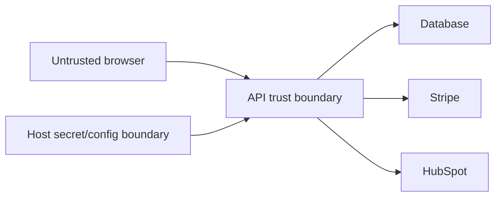

# Security and Threat Model

## Scope

This threat model covers the React client, ASP.NET Core API, database, authentication flow, Stripe integration, HubSpot integration, and deployment configuration represented in this repository.

## Assets

- Staff/Admin credentials and JWT signing material
- Customer identity and contact information
- Product prices and inventory state
- Orders, totals, status, and activity history
- Stripe and HubSpot credentials and provider references
- Database connection strings
- Authorization and field-permission configuration

## Trust Boundaries

All browser input is untrusted. External-provider responses are also validated before they influence local order state.

## Threats and Mitigations

| Threat | Existing mitigations | Recommended future mitigations |
| --- | --- | --- |
| Payment tampering | Server reloads prices, recalculates totals, and verifies PaymentIntent status, amount, and currency. Stripe Elements handles card data. | Verify Stripe webhooks, add reconciliation jobs, and monitor mismatches. |
| Credential compromise | PBKDF2-SHA256 hashes, signed JWT validation, production JWT-secret checks. | Add MFA, account lockout, password reset, token revocation/rotation, and login rate limits. |
| Privilege escalation | Role policies, resource/action permissions, editable-field checks, backend authorization. | Add exhaustive permission-matrix tests and independent authorization review. |
| API abuse | Input ranges, page-size bounds, payload-field allowlists, CORS restrictions. | Add rate limiting, abuse detection, quotas, and edge protection. |
| Secret exposure | Private settings remain server-side; local secret files are ignored; Vite values are treated as public. | Use a managed vault, workload identity, rotation, secret scanning, and image scanning. |
| Unsafe user input | Server normalization/validation, markup-like input rejection, React text escaping, no raw HTML rendering. | Add centralized exception handling, content-specific encoding review, and security testing. |
| Invoice HTML injection | Razor encodes invoice values, the model is built from persisted server data, and client totals/payment references are not accepted. | Add template security review and document-retention policy before invoices become regulated records. |
| Data leakage | DTOs limit response shape; sensitive provider references are excluded from normal permission visibility. | Add data-classification, retention, access auditing, and privacy review. |
| Session theft through XSS | React escapes rendered text and the API sets baseline response headers. | Prefer an HttpOnly cookie/BFF model or stronger token containment; define frontend CSP compatible with Stripe. |
| Dependency compromise | Locked npm dependencies and repeatable CI installation. | Add dependency review, SAST, SBOM generation, and automated update policy. |

## Existing Security Controls

- JWT issuer, audience, lifetime, and signature validation
- Staff/Admin policies plus resource/action permission checks
- Editable-field validation against shared permission configuration
- PBKDF2-SHA256 password hashing with per-password salt and fixed-time verification
- Server-side validation and payload-field allowlists
- Configured CORS origins
- HTTPS redirection and HSTS outside development/testing
- Baseline response headers
- Production startup guardrails for JWT secret and database provider
- Stripe PaymentIntent verification before card order creation
- Server-side Razor invoice rendering without provider payment references

## Required Production Work

- Managed secrets and key rotation
- Rate limiting and credential-abuse controls
- Centralized exception handling and security logging
- Security scanning in CI
- Stripe webhook signature verification
- Token lifecycle, revocation, and recovery procedures
- Backup, retention, privacy, and incident-response policies
- Formal threat-model review after infrastructure and hosting choices are known
